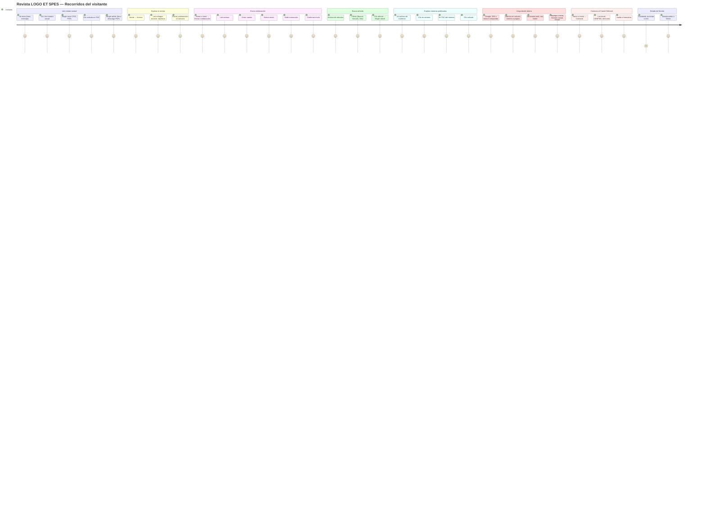

# Revista de Filosofía LOGO ET SPES — Diagrama de Recorrido del Usuario

Diagrama Mermaid. Basado en `10-user-journey`. Puntuación 1–5: fluidez del flujo (5 = sin fricción). Actor: **Visitante**.

---

---

**Referencia:** `10-user-journey`
